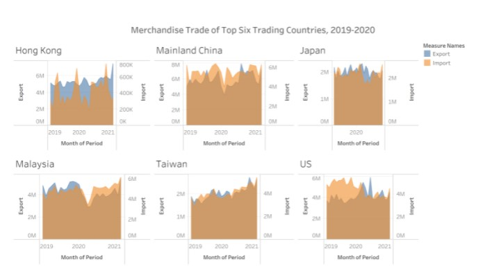

```{r setup, include=FALSE}
knitr::opts_chunk$set(echo = FALSE)
```
# 1.0 Critique of Visualisation
The original visualisation can be seen below.


### 1.1	Clarity
(1)	It is hard to compare countries’ performance across six separate charts shared with different scales in y-axis.\
(2)	For x-axis with title month of period, but we cannot tell each month performance clearly in the charts.\
(3)	For Japan, there is only ‘2020’ in the x-axis, which is not align with other charts.\
(4)	The title is misleading with ‘top trading’, we do not know the rank of top trading is by export or import or the total amount. Also, the title as ‘six countries’ but some of them are only regions instead of countries.\
(5)	In raw data, the trade amount is with unit as ‘thousand dollars’, the chart did not mention.\

### 1.2	Aesthetic
(1)	The tick line for y-axis is not obvious.\
(2)	There are two y-axes with different scale, it’ s not possible to put them together to do comparison.\
(3)	To show the time-serious trend line instead of the area chart which is hard to see the trade amount changing along the time.\
(4)	There is clear indication of data source stated in the chart.
(5)	There is no clear indication of month in the y-axis.\
(6)	Each chart is too narrow to show the message of monthly data.\

# 2.0	Alternative design
 


(1)	In order to clearly compare difference between 2019 and 2020 and in export and import value and trend chart, 2 individual charts as show in the initial visualization.\
(2)	All charts with title and subtitle to explain key words and definitions will be showing in graph.\
(3)	Y-axis are unified to do comparison in the same scale for different years and different trading methods.\

# 3.0	Proposed Visualization
Data Visualization can be found in Tableau Public Server: 
[Dashboard](https://public.tableau.com/app/profile/xiaojing.shen/viz/dataviz-1/Dashboard1)


# 4.0	Step-by-step Guide
### 4.1	Data preparation
Select only data for 6 regions, Filter variables = ‘Hongkong, Mainland China, Japan, Malaysia, Taiwan, US’. Select only year 2019-2020 for import and export data sets and paste into a new sheet using Microsoft Excel.


  

### 4.2	Import the two data sets into Tableau.

Connection: Choose Extract to allow them to go public

 
  
 


### 4.3	The first chart is showing the difference between 2019 and 2020. Left chart as import 
and right chart as export.
(1)	Change the data type for [Year] from number to date&time
    
   
(2)	Columns: Drug [Export] and [Import] value

  

(3)	Rows: Region
   
  
(4)	Color: Year 
Edit color as opacity 66%
      
    
(5)	Edit x- axis, to make two axis (export and import) face to each other, by reversing the scale of export.
  
 


(6)	To make year 2019 and 2020 stack to each other to compare easily, need to off the stack marks.
 
 

 
Final look
 

### 4.4	The second chart is showing the trend between 2019 and 2020. 
   
   
   
(1)	Columns: Region, Month
Rows: Sum by month
Color: Export or Import


   
(2)	Date change to Month


 
### 4.5	Create new dashboard
 


# 5.0	Major Observations
(1) Mainland China has largest value among the 6 regions for export and import in 2019 and 2020.\
(2) Taiwan and Hong Kong both import and export are increasing from 2019 to 2020, with a continuous up trend.\
(3) For Malaysia, there is a sharp decline in both import and export in April 2020.From news, Statistician chief Datuk Seri Dr Mohd Uzir Mahidin said the decrease was due to the shutdown of most of the national economic sectors since the enforcement of the Movement Control Order (MCO) on March 18 due to the Covid-19 pandemic. (Sharp decline in Malaysia's exports | New Straits Times, 2021)\
(4) Hong Kong has the second highest in export value but the last for the import value. The Import value is only about 1/10 of Mainland China.\
(5) Japan Import and export value are almost equivalent in 2019 and 2020, which is relatively stable.\


