```{r setup, include=FALSE}
knitr::opts_chunk$set(echo = FALSE)
```
# 1.0 Critique of Visualisation
The original visualization can be seen below.
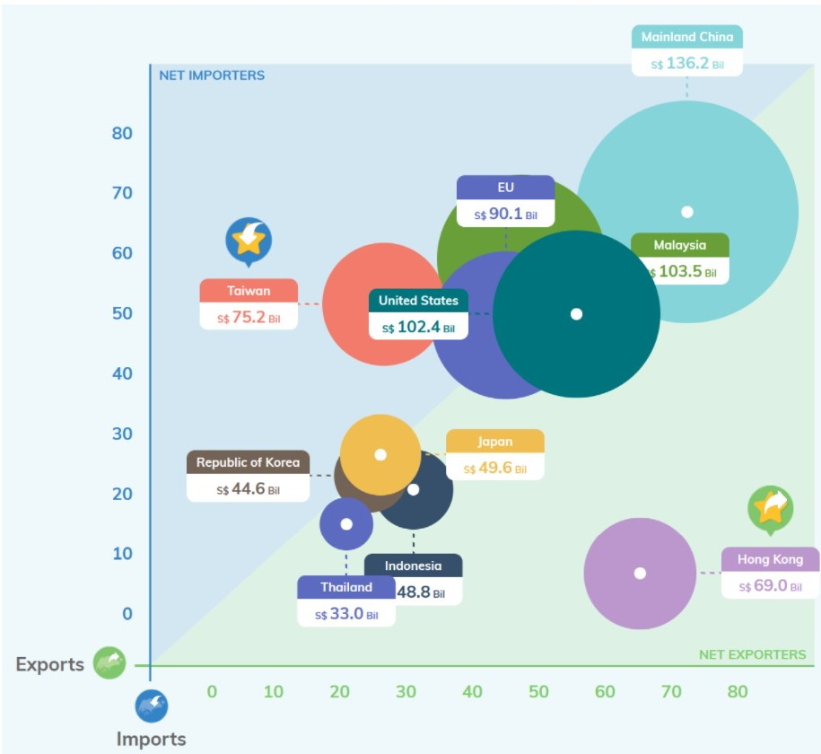
The data was retrieved from the [Department of Statistics, Singapore (DOS)](https://www.singstat.gov.sg/find-data/search-by-theme/trade-and-investment/merchandise-trade/latest-data)

### 1.1	Clarity
(1) **There is no title for this graph**: not indicating which year and time for this graph, we do not have idea on the purpose of this graph.\

(2)	**There is no unit in both x, y -axis** :should be in billion Dollars instead of million ,since the data source indicates “(Thousand Dollars)”.\

(3) **There is no year to year difference** :	The information given as "Singapore exports with china since 2009 exceeds with USA since 2006" , but it is not reflecting in the chart, we can not tell year to year difference by this chart.\

(4) **There is no legend**:for the scale of color and size for the bubbles.


### 1.2	Aesthetic
(1)	**Overlap problem**: There is no transparency of circle, some bubble was blocked by others. Some center points are hidden by other circle/title.\
(2)	**Too colorful in the chart**: however, the color separation between net importers and net exporters are not distinct.The color for bubbles also do not have any useful information.\
(3)	**Title of each bubble is misleading**: the direction is not consistent and the size of each diaLog box is not aligned .\

# 2.0	Alternative design
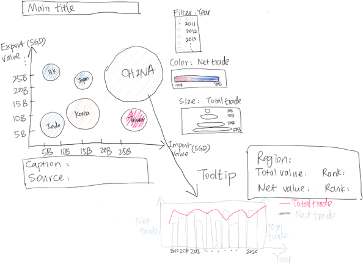 


(1)	In order to clearly compare difference between 2010 to 2020 for each country in net trade value and total trade value and trend chart, 2 individual charts as show in the initial visualization.\
(2)	All charts with title and captions to explain key words and definitions will be showing in graph.\
(3) The value units as been unified by billion Singapore dollars.\
(4) For the bubble chart, the Color difference is by net trade value and size difference is by total trade value.\
(5) For every bubble, there is a tooltip to indicate net trade value and total trade value and the ranking respectively. In addition, there is a chart shows 10 years changing in the tooltip.\


# 3.0	Proposed Visualization
Data Visualization can be found in Tableau Public Server: 
[Dashboard](https://public.tableau.com/app/profile/xiaojing.shen/viz/Book2_16239835623390/Dashboard1)

[Bubble chart](https://public.tableau.com/app/profile/xiaojing.shen/viz/Book2_16239835623390/Bubblechart)\


# 4.0	Step-by-step Guide
### 4.1	Data preparation
There are 2 .xlsx format sheets:\
T1 : Merchandise Imports by Region/Market, Monthly\
T2 : Merchandise Exports by Region/Market, Monthly \

With variables(country),Date,Export and import value\

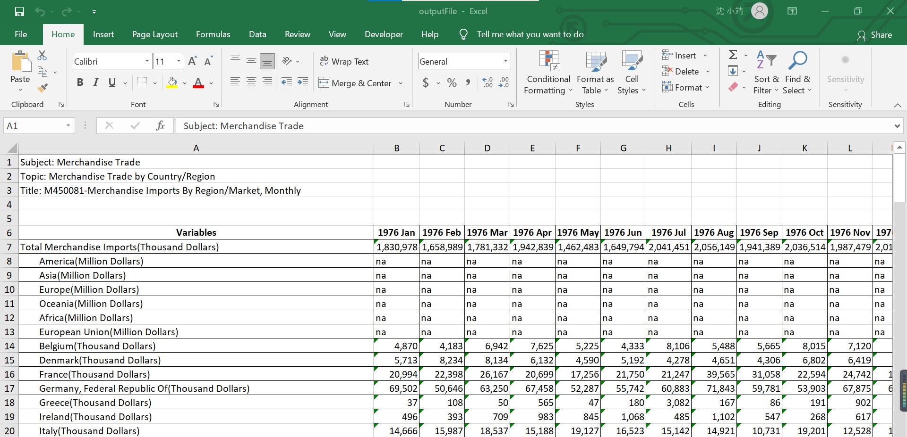{width=50%}\

  

### 4.2	Import the two data sets into Tableau.
(1)launch the Tableau Desktop software.\

(2)Import the Data. From the local directory where the dataviz2_rawData.csv is saved, drag and drop into the homepage as shown:\
{width=50%}\

(3)Drag T1 into the workspace.\

 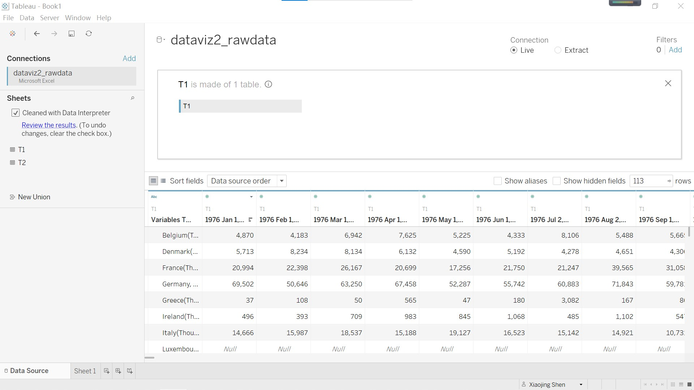{width=70%}\

(4)Apply filter for country, keep 10 countries.\
 Click on the Add|Filter button and then Add.\
 
  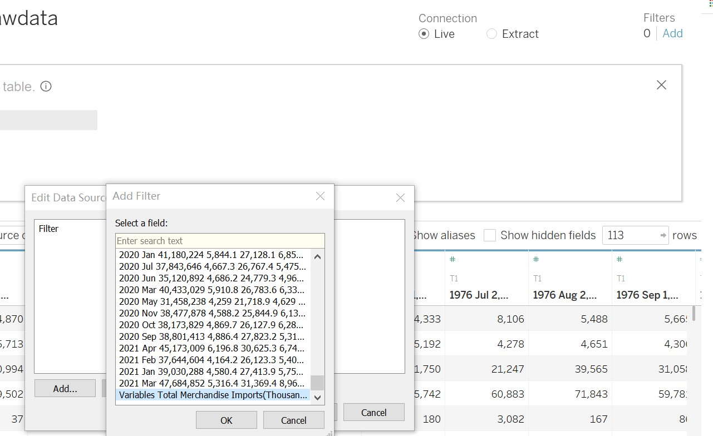{width=90%}\


Select all the 10 Regions that were listed: Mainland China, Malaysia, Hong Kong, Taiwan, United States, Japan, Korea, Indonesia,
EU,Thailand\
  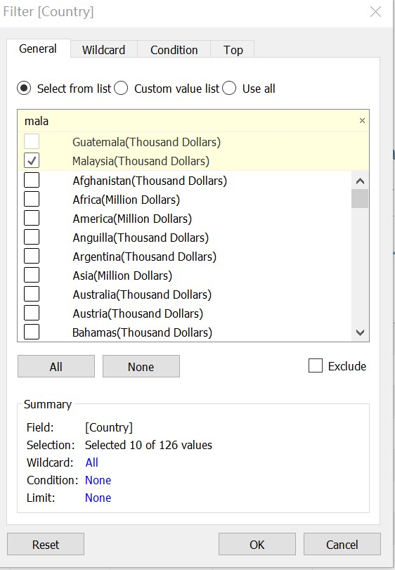{width=40%}\


We will see the filter added as shown below. Register the changes by clicking Ok\
  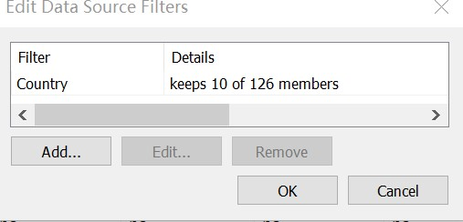{width=40%}\


(5)Pivot the table.\
Select all the columns and select Pivot\
  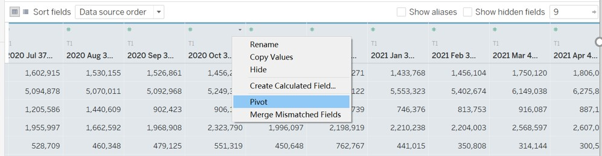{width=80%}\


After Pivot, table shows as below:\
 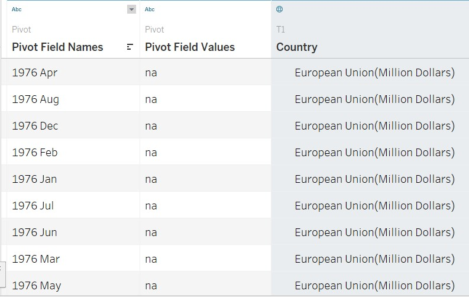{width=50%}


(6)Formatting& Renaming\

The first column format as Date\
  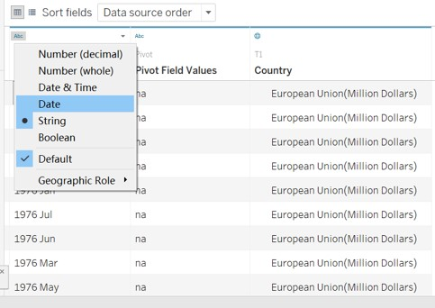{width=50%}\

**Rename**
First column as Dates,Second column as Import Value,Third column as Country\
  {width=50%}\


(7)Filter Date\

Add filter: click at right hand side corner\

{width=30%}\
  


Select year>>next>\
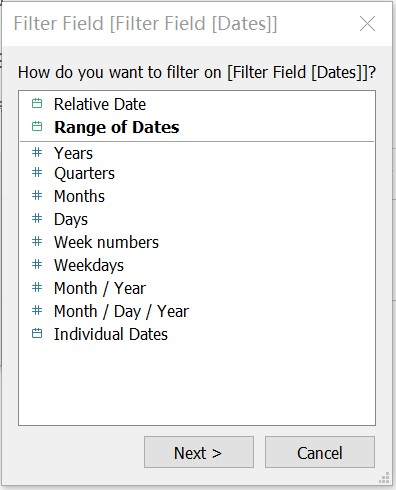{width=30%}
  
  


Select 2011-2020\
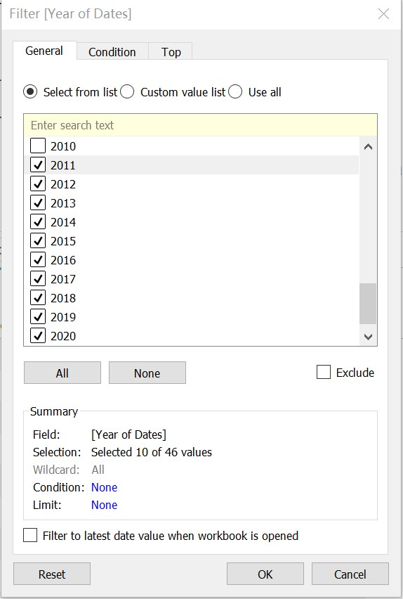{width=50%}\


(8)Save the file as Import_T1.csv\

(9)Repeat above steps for T2 and Save the file as Export_T2.csv\


(10)In two csv files, to align the units for import and export values, times the existing value with 1mil for EU dollar, and times 1000 for the rest 9 countries.\
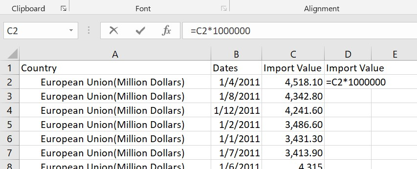{width=50%}\

 
 (11)Merge the two files.\
 
 Open T1 first , then click Add to add T2\
 {width=50%}\
 
 To merge two tables : use inner join, join country and dates\
  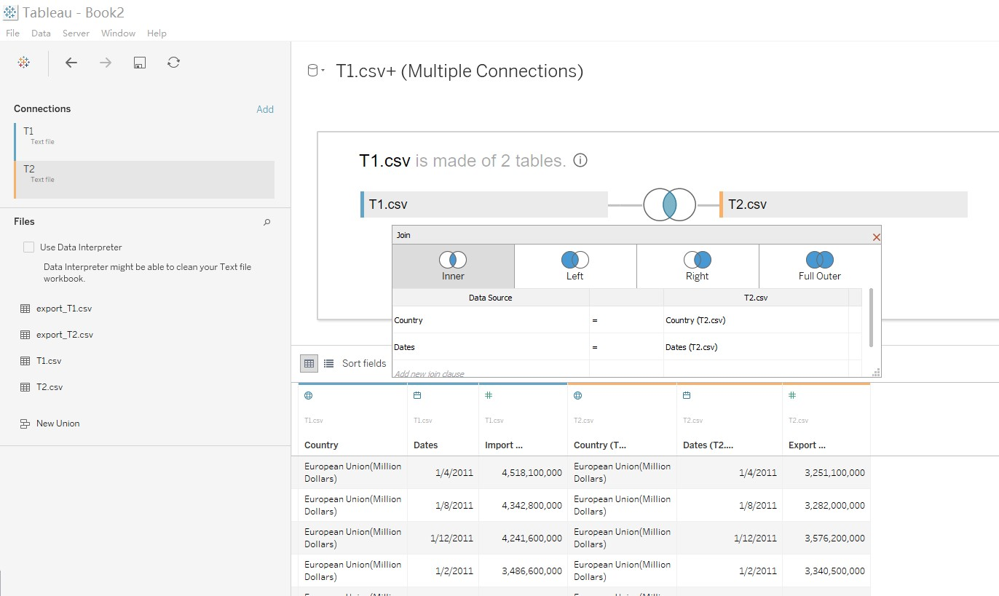{width=80%}\
 
 Hide the repeated columns:Right click and select Hide\
   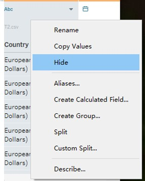{width=20%}\
   
(12)Create aliases for country data\
 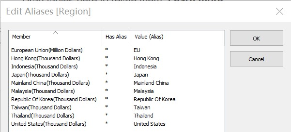{width=50%}\

 
### 4.3	Creating charts. 
To make a bubble chart for import and export value.x-axis as import and y-axis as export.\

(1)Drag and drop the variables:Import value and export value into column and rows. \
   {width=50%}\  
   
   
(2)Drag country into detail: \
   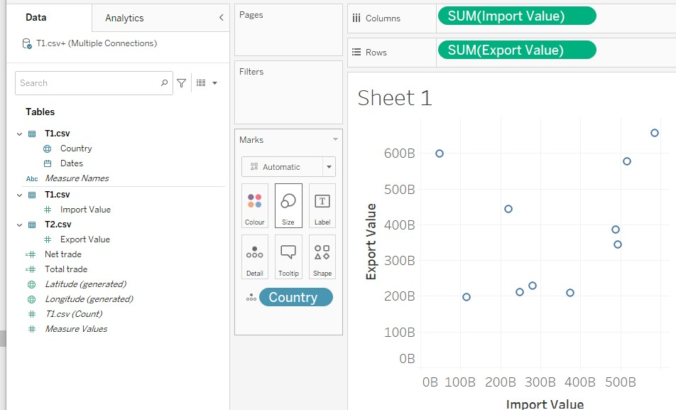{width=50%}\  

(3)Analysis> Add calculation field:\

Net trade\
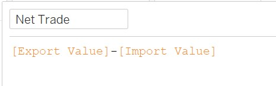{width=50%}\ 

Total trade\
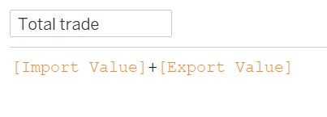{width=50%}\
  
(4)Color: Net trade \
Edit color as opacity 66%\
    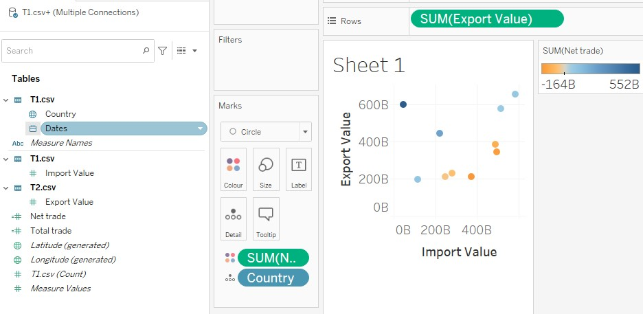{width=80%}\ 
    
(5)Size: Total trade \
  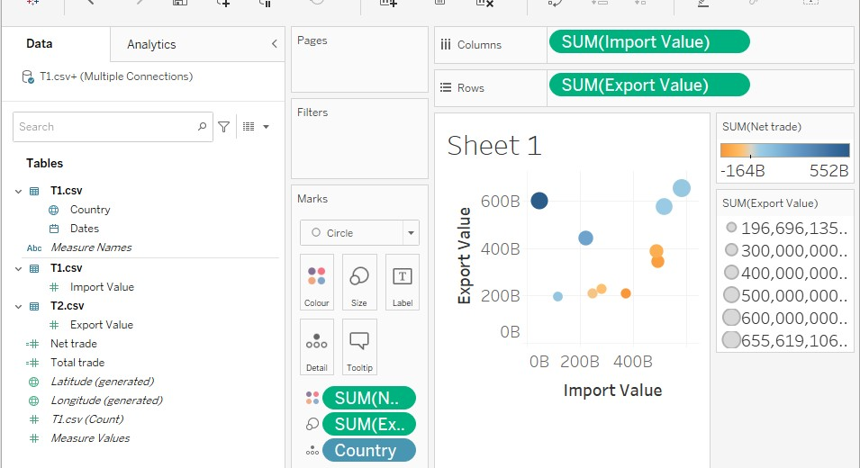{width=80%}\ 


(6)Add filter: Year\
set as single value(list)\
 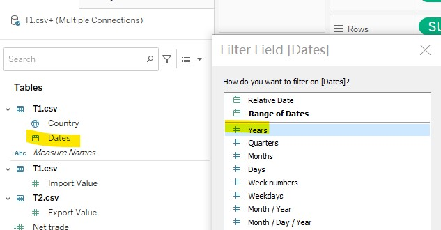{width=40%}\ 
 
Show Filter\
 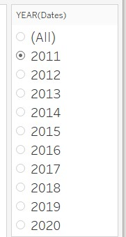{width=20%} \
 
 (7)Edit Title:\
 
  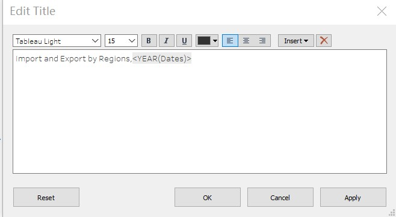{width=50%}\ 

 (8)Add calculation for ranking:\
 Rank for Total trade:\
 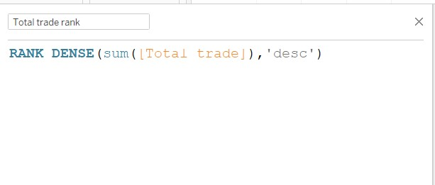{width=50%}\ 

Rank for Net trade:\
 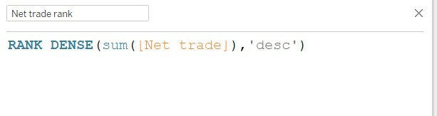{width=50%}\ 


(9)Edit for tooltip:\
 {width=30%}\ 
 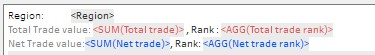{width=30%}\ 

(10)Create a second chart for tooltip:\
showing annual trade value for net and total trade in 2010-2020.\

 Drag year to columns, Net trade and total trade into Rows\
 
  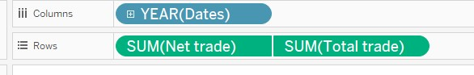{width=50%}\
  
Select Net trade as bar chart:\
  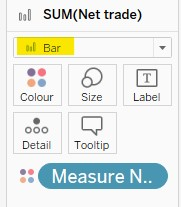{width=30%}\
Select total trade as line chart:\
  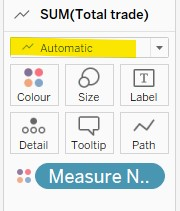{width=30%}\

Set title as :Annual net trade and total trade value\
Change the two axis color.\

Final chart looks like:\

 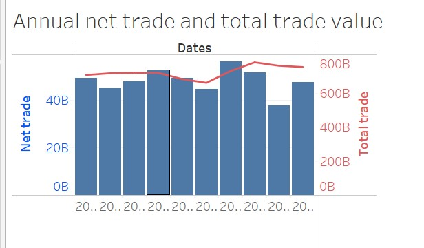{width=50%}\
 

(11)Add caption to describe all settings and data source\

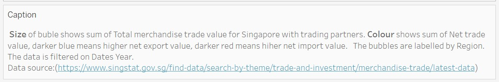{width=80%}\

**Final look for bubble chart**\


 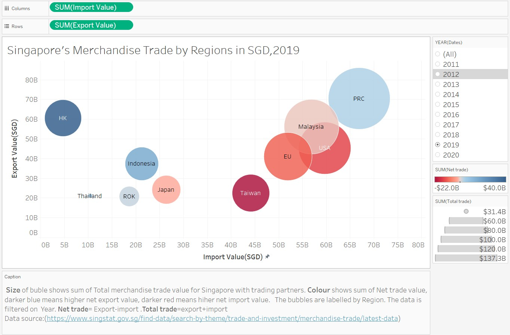\


 With tooltip added in\
 
  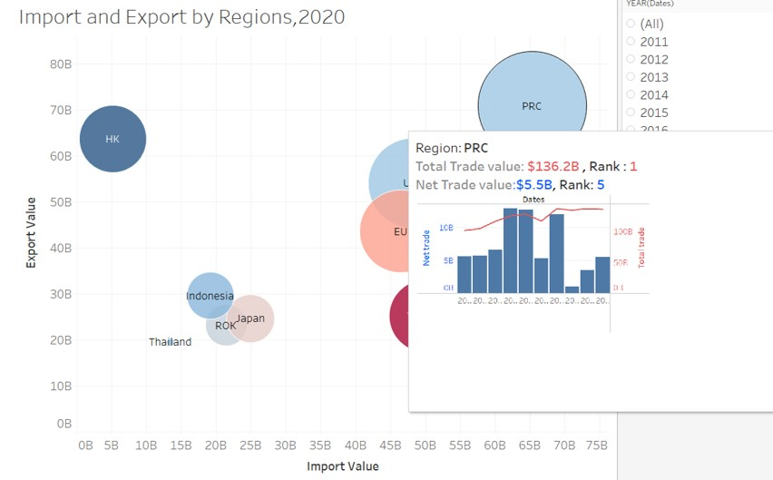\
 
### 4.4	Second chart

To monitor the quarterly changes for net trade value and total trade value, I added in a new chart, same as the chart in the tooltip, but add in the quarter in the columns.

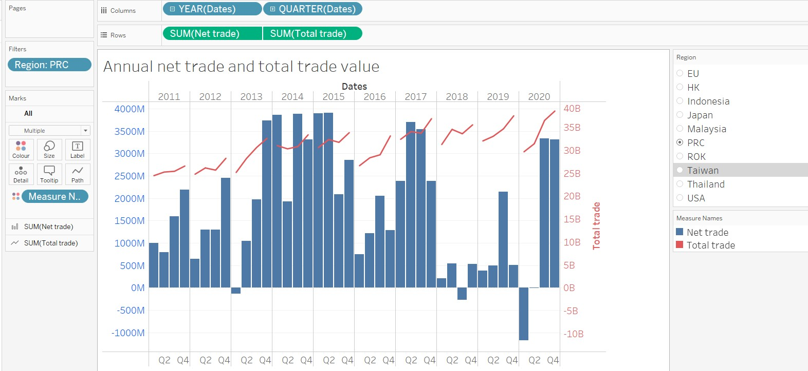\
 
 
### 4.5	Create new dashboard
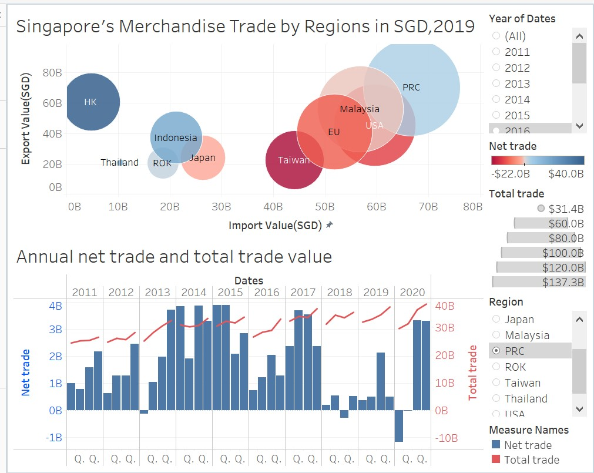\


# 5.0	Major Observations
(1)**United States of America(USA)**:\
* Total trade amount with the USA is about 19 Billion, increased from 2018 Q1 at 21 Billion to 2020 Q1 at 26 billion , and decreased to 24 billion at Q3 and Q4 2020.\
* The Covid-19 pandemic trend up on Q2 2020 which has impact on trading and economic.[Second-quarter GDP plunged by worst-ever 32.9% ](https://www.cnbc.com/2020/07/30/us-gdp-q2-2020-first-reading.html)
* The USA was top 2 net importer from 2011 to 2019.However,From the 2020 Q2, it turns to be an exporter.[From January to June 2020, exports of U.S. goods dropped by almost 25 percent, while imports of goods dropped by about 17 percent](https://research.stlouisfed.org/publications/economic-synopses/2020/09/16/the-dynamics-of-the-u-s-trade-deficit-during-covid-19-the-role-of-essential-medical-goods)\

(2)**Indonesia**:\
 Indonesia was the second largest Net exporter for Singapore in last ten years. However, the total trade value decreasing from 2010-2016 from 20 bil to 14 bil, then back to 17 bil in 2018, and has a dramatic drop in 2020 Q2 due to covid pandemic.[Indonesia's exports, imports nosedive in May as COVID-19 restrictions hit trade Time to dwell](https://www.thejakartapost.com/news/2020/06/15/indonesias-exports-imports-nosedive-in-may-as-covid-19-restrictions-hit-trade.html)\

(3)**Malaysia**:\
Indonesia was the top 2 largest trade partner for Singapore in last ten years.From 2011 Q1 to 2016 Q2, Malaysia was the top 5 net exporter. And almost break even from 2016 Q3 to 2019 Q4. On the contrary,it become net importer in 2020.[The largest net imports into Singapore were from Malaysia at 699,000 tonnes](https://www.reuters.com/article/singapore-fueloil-idINKCN25217I)\

(4)**Hong Kong**:\
Hong kong was the top exporter for Singapore in last ten years.Even during the covid pandemic period in 2020 Q2 , the trade value was about the same as in 2019 and reverted back from Q2 to Q4.
[Hong Kong mainly exported machines, precious metals and transportation facilities to Singapore](https://en.wikipedia.org/wiki/Hong_Kong%E2%80%93Singapore_relations#cite_note-tradeb-11)\


