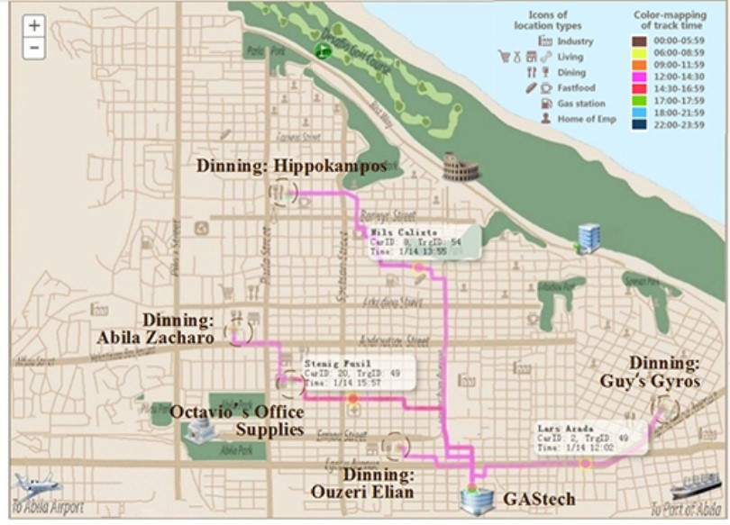
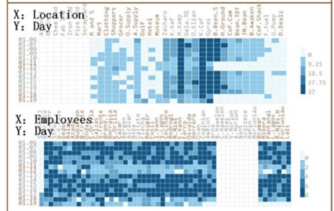
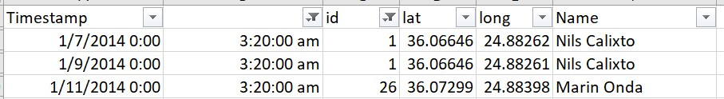

# 1.0  Overview

## 1.1	Introduction

This assignment is to do the data visualization on the [Vast-challenge 2021 mini-challenge 2](https://vast-challenge.github.io/2021/MC2.html) to give some insight. The background of this challenge is, some employees from company GAStech located in Abila and we need to find out the abnormality to identify which GASTech employees made which purchases and identify suspicious patterns of behavior. And cope with uncertainties that result from missing, conflicting, and imperfect data to make recommendations for further investigation.\

The data are the 2 weeks data before their missing date. Including  employees' credit card and loyalty card transaction records, gps records, and car assignment.The company cars which are approved for both personal and business use, and the vehicles are tracked periodically as long as they are moving.\

This assignment is done as a groundwork for an interactive Shiny app. The purpose of this assignment is to explore the packages that can be used and finding how interactivity can be added to the application to help the users in exploring the data.\

## 1.2	Literature Review


The same challenge was performed in [2014](http://visualdata.wustl.edu/varepository/VAST%20Challenge%202014/challenges/MC2%20-%20Patterns%20of%20Life%20Analysis/).Hence, we can get some clue of method has been used in our analysis.\

A background map of this town is necessary as we have the gps data on the map to view the track of the cars' movement. Most of the analysis has applied the map as the background map , and applied the gps data with different car ID and time lines on the map. \

To plot out the map with gps point on the surface, I will use **tmap packages** in the following paragraphs to plot the gps data. tmap package designed to generate the thematic maps with great flexibility. The syntax for creating plots is similar to that of ggplot2, but tailored to maps. \

{width=80%}

Another method which can be applied in my analysis is to plot a heat map timeline by transactions in different locations. This can help us to observe the pattern of normal activity in certain period also some abnormality activity can be observed. \

Heat maps allow us to simultaneously visualize clusters of samples and feature, where data values are transformed to color scale.The most basic heatmap I can build with R and **ggplot2** , using the geom_tile() function.Input data must be a long format where each row provides an observation. At least 3 variables are needed per observation: x as position on the X axis ; y as position on the Y axis ; fill with the numeric value that will be translated in a color. \

{width=80%}

Literature review was conducted to analyze what's the possible approaches of doing the EDA to visualize the relationships between input variables and the target variable. For this dataset, most of the input variables are based on record with time-series based and ID-based.\


## 2.0 Data preparation 
### 2.1	Load packages 

We need to set up the environment and load all required packages first. The code chunk below will install the packages if not yet installed, and load them to the environment.\

```{r setup, include=FALSE}
knitr::opts_chunk$set(echo = TRUE)
```
```{r echo=TRUE, collapse=TRUE}
packages = c('raster', 'sf', 
             'tmap', 'clock', 
             'tidyverse')
for (p in packages){
  if(!require(p, character.only = T)){
    install.packages(p)
  }
  library(p,character.only = T)
}
```

### 2.2	Data loading

(1) Load background image\

```{r echo=TRUE, collapse=TRUE}
library("rgdal")
bgmap <- raster("C:/xiaojingshen/DataViz_blog/_posts/Assignment/Geospatial/MC2-tourist.tif")
```

(2) Set MC2-tourist as background image and configure it.\

```{r echo=TRUE, fig.height=5, collapse=TRUE}
tm_shape(bgmap) +
tm_rgb(bgmap, r = 1,g = 2,b = 3,
       alpha = NA,
       saturation = 1,
       interpolate = TRUE,
       max.value = 255) 
```

(3) Load street information.\

```{r echo=TRUE, collapse=TRUE}
Abila_st <- st_read(dsn = "C:/xiaojingshen/DataViz_blog/_posts/Assignment/Geospatial",
                    layer = "Abila")
```


(4) Load Gps data.\

```{r echo=TRUE, collapse=TRUE}
library("readr")
gps <- read_csv("C:/xiaojingshen/DataViz_blog/_posts/Assignment/data/gps.csv")
```


### 2.3	Data manipulation

(1) Convert time stamp to date_time format, add day,hour,minutes columns into gps table.\

```{r echo=TRUE, collapse=TRUE}

gps$Timestamp <- date_time_parse(gps$Timestamp,
                zone = "",
                format = "%m/%d/%Y %H:%M")
gps$day <- as.factor(get_day(gps$Timestamp))
gps$hour <- as.factor(get_hour(gps$Timestamp))
gps$minute <- as.factor(get_minute(gps$Timestamp))
```
(2) change data type of gps_id to factor.\

```{r echo=TRUE, collapse=TRUE}
gps$id <- as_factor(gps$id)
```

(3) Create a sf object from gps and coordination.\

```{r echo=TRUE, collapse=TRUE}
gps_sf <- st_as_sf(gps, 
                   coords = c("long", "lat"), #<<
                       crs= 4326)#<<

```

(4) Join the gps points into movement paths by using the drivers' IDs as unique identifiers.\

```{r echo=TRUE, collapse=TRUE}
gps_path <- gps_sf %>%
  group_by(id, day) %>%
  summarize(m = mean(Timestamp), do_union=FALSE) %>%
  st_cast("LINESTRING")

```

(5) load cc_data into a new table which will be used for the heatmap analysis.\

```{r echo=TRUE, fig.height=6, collapse=TRUE}
#library("readr")
#library(dplyr)

credit_card_record <- read_csv("C:/xiaojingshen/DataViz_blog/_posts/Assignment/data/cc_data.csv")
credit_card_record$C_timestamp <- date_time_parse(credit_card_record$timestamp,
                zone = "",
                format = "%m/%d/%Y %H:%M")
credit_card_record$hour <- get_hour(credit_card_record$C_timestamp)
credit_card_record$day <- get_day(credit_card_record$C_timestamp)
```
### 2.4	Overview of Variables

(1) A list of vehicle assignments by employee, in CSV format (car-assignments.csv).\

Name|Category|Allowable Values
---|:---|:---
LastName|Categorical|Names
FirstName|Categorical|Names
CarID|integer|1 to 35
CurrentEmploymentType|Categorical|IT,engineer,Executive,Security,Facilities
CurrentEmploymentTitle|Categorical|IT Helpdesk,Engineer,SVP/CFO


(2) A CSV file containing credit and debit card transaction data (cc_data.csv). \

Name|Category|Allowable Values
---|:---|:---
timestamp|Numerical|1/6/2014 7:28
location|Categorical|Brew've Been Served
price|Numerical|11.34
last4ccnum|Numerical|4795


(3) A CSV file containing loyalty card transaction data (loyalty_data.csv). \

Name|Category|Allowable Values
---|:---|:---
timestamp|Numerical|1/6/2014 7:28
location|Categorical|Brew've Been Served
price|Numerical|11.34
last4ccnum|Numerical|L2247

(4) A CSV file containing loyalty card transaction data (loyalty_data.csv). \

Name|Category|Allowable Values
---|:---|:---
timestamp|Numerical|1/6/2014 7:28
ID|integer|1 to 35
lat|Numerical|36.0762253
long|Numerical|24.87468932


(5) A tourist map of Abila with locations of interest identified, in JPEG format (MC2-Tourist.jpg). \


## 3.0 Tasks and Questions
### 3.1	Using just the credit and loyalty card data, identify the most popular locations, and when they are popular. What anomalies do you see? What corrections would you recommend to correct these anomalies? Please limit your answer to 8 images and 300 words.\

To investigate the most popular locations over different time period, I used heat map by plotting locations at x-axis and hours of time stamp in the y-axis , colored by count of transactions.\
When plot the Calendar Heat map, we can see the high-density points are fall in 7 to 8 am, 12 to 1pm and 19 to 20 pm. \

```{r echo=TRUE, fig.height=6}
# Library
library(ggplot2)

df_hmap <- data.frame(credit_card_record$hour, credit_card_record$location)
colnames(df_hmap) <- c("hour", "location")

# Heatmap 
ggplot(df_hmap, aes(x=hour , y=location)) + geom_bin2d() + scale_fill_gradient(low="lightblue", high="black") + scale_x_continuous("hour", labels = as.character(credit_card_record$hour), breaks = credit_card_record$hour)

```

7 to 8 am in the morning, most people went to Brew’ve been served, followed by Hallowed Grounds, coffee cameleon, abila airport and kronos Mart. \

12 to 1 pm in the noon, most people went to dinning venues to have lunch. But we still observed a few people went to Carlyle Chemical Inc., Stewart and Sons Fabrication Chostus Hotel, Desafio Golf Course, Nationwide Refinery, Ahaggo Museum. \ 

From dinner time 7 pm to 8 pm, most people went to dinning venues to have dinner.However, one people went to abila Zacharo, and two went to Roberts and Sons. \

### 3.2	Add the vehicle data to your analysis of the credit and loyalty card data. How does your assessment of the anomalies in question 1 change based on this new data? What discrepancies between vehicle, credit, and loyalty card data do you find? Please limit your answer to 8 images and 500 words. \

This picture shows a pattern of the driving paths of all employees from 3 am to 5 am. Generally there is no shops open so early in the morning, we can refer to the employee which has credit card transactions in this time period and date , to match the credit card data with gps data. \

```{r echo=TRUE, fig.height=6, collapse=TRUE}
gps_Morning_view <- gps_sf %>% mutate(Morning_timestamp = hms::as_hms(gps_sf$Timestamp)) %>% filter(Morning_timestamp >= hms::as_hms('03:00:00'), Morning_timestamp <= hms::as_hms('05:00:00'))
```

```{r echo=TRUE, fig.height=6}

tmap_mode("view")
tm_shape(bgmap) +
  tm_rgb(bgmap, r = 1,g = 2,b = 3,
       alpha = NA,
       saturation = 1,
       interpolate = TRUE,
       max.value = 255) +
  tm_shape(gps_Morning_view) + tm_dots(col="black")
```


### 3.3 Can you infer the owners of each credit card and loyalty card? What is your evidence? Where are there uncertainties in your method? Where are there uncertainties in the data? Please limit your answer to 8 images and 500 words. \


When plot the transaction amount per loyalty card by date time stamp.There are some transactions at certain time is abnormal. \
Like **L4063** spent 4 times , each time over 2000 dollars at 6am in the morning. This card has spend over 3000 dollars at 8am on 6th Jan and 13th Jan at Abila Airport. \
**L9633** has spend about 1000 dollars everyday 10 am at Nationwide Refinery and spend over 2000 dollars at 11 am at Stewart and Sons Fabrication.\
**L2769**  had 15 transactions over at Abila Airport at 12:30 and 15:30 everyday. \

There are some cards with high transaction amount. **L8477**has 4 transactions at Kronos Pipe and Irrigation over 2000 dollars, has 4 over 1000 dollars at Maximum Iron and Steel and 2 transactions at Carlyle Chemical Inc. \

 **L7761** has transaction at 9am at Abila Airport , 10 am at Stewart and Sons Fabrication , 12am at Nationwide Refinery repeatedly on 7th Jan, 9th Jan, 14th Jan and 16th Jan. \

```{r echo=TRUE, fig.ext=TRUE}
# Library
library(ggplot2)

df_price_map <- data.frame(credit_card_record$day, credit_card_record$last4ccnum, credit_card_record$price)
colnames(df_price_map) <- c("day", "credit_card_number", "price")

# Heatmap 
ggplot(df_price_map, aes(x=day , y=credit_card_number, fill=price)) + geom_tile() + scale_fill_gradient(low="lightgreen", high="black") + scale_x_continuous("day", labels = as.character(credit_card_record$day), breaks = credit_card_record$day) + scale_y_continuous("credit_card_number", labels = as.character(credit_card_record$last4ccnum), breaks = credit_card_record$last4ccnum )
```


### 3.4 Given the data sources provided, identify potential informal or unofficial relationships among GASTech personnel. Provide evidence for these relationships. Please limit your response to 8 images and 500 words.\

(1) It is abnormal that there are some transactions happen at 3am in the morning with relatively high amount spend at **Kronos Mart**.There are generally no shops open late at night, but this mall is still open late at night, and several corporate customers have very close consumption records, which is very suspicious.  \

**8156** has spent over 250 dollars at 3am on 12th Jan.
**5407** has spent about 150 dollars on 13th Jan.
**3834** , **8332**, and **9551** have spent about 150 dollars in the morning on 19th Jan.\

```{r echo=TRUE, fig.ext=TRUE, fig.height=11}
# Library
library(ggplot2)
df_hour_price_map <- data.frame(credit_card_record$hour, credit_card_record$last4ccnum, credit_card_record$price)
colnames(df_hour_price_map) <- c("hour", "credit_card_number", "price")

# Heatmap 
ggplot(df_hour_price_map, aes(x=hour , y=credit_card_number, fill=price)) + geom_tile() + scale_fill_gradient(low="lightblue", high="black") + scale_x_continuous("hour", labels = as.character(credit_card_record$hour), breaks = credit_card_record$hour) + scale_y_continuous("credit_card_number", labels = as.character(credit_card_record$last4ccnum), breaks = credit_card_record$last4ccnum )
```


(2) There are some abnormal activities at midnight from 00:00 to 1am.\

Nils Calixto drive from Gastech to home at 00:09 on 16th Jan. \

```{r echo=TRUE, fig.height=6, collapse=TRUE}
gps_Nils_view <- gps_sf %>% mutate(Nils_timestamp = hms::as_hms(gps_sf$Timestamp)) %>% filter(id == 1) %>% filter(Nils_timestamp >= hms::as_hms('00:00:00'), Nils_timestamp <= hms::as_hms('02:00:00'))
```

```{r echo=TRUE, fig.height=6}

tmap_mode("view")
tm_shape(bgmap) +
  tm_rgb(bgmap, r = 1,g = 2,b = 3,
       alpha = NA,
       saturation = 1,
       interpolate = TRUE,
       max.value = 255) +
  tm_shape(gps_Nils_view) + tm_dots(col="blue")
```


Marin Onda driving from one place to home on 1/11 at 12:22. \

```{r echo=TRUE, fig.height=6, collapse=TRUE}
gps_Marin_view <- gps_sf %>% mutate(Marin_timestamp = hms::as_hms(gps_sf$Timestamp)) %>% filter(id == 26) %>% filter(Marin_timestamp >= hms::as_hms('00:00:00'), Marin_timestamp <= hms::as_hms('02:00:00'))
```

```{r echo=TRUE, fig.height=6}

tmap_mode("view")
tm_shape(bgmap) +
  tm_rgb(bgmap, r = 1,g = 2,b = 3,
       alpha = NA,
       saturation = 1,
       interpolate = TRUE,
       max.value = 255) +
  tm_shape(gps_Marin_view) + tm_dots(col="blue")
```


### 3.5 Do you see evidence of suspicious activity? Identify 1- 10 locations where you believe the suspicious activity is occurring, and why Please limit your response to 10 images and 500 words.\

Location and Time: In 1/7, 1/9 ,1/14 morning from 3:00am - 5:00am, we find out that some invalid tracks for people. He drove from near Speton Park and Taxiaichen Park to near Frydo's autosupply.\
People Involved: Loreto Bodrogi,Isia Vann,Minke Mies,Hennie Osvaldo ,Nils Calixto ,Marin Onda \

Reason: Usually, people will not go outside in those time, and they came to the same locations frequently at werid timestamp which made them suspcious.\

Hypothesis: Their destination is at Isia Vann's home. \

(1) gps for **Loreto Bodrogi** on 1/7, 1/9  at 3:00 to 5:00. \ 

```{r echo=TRUE, fig.height=6, collapse=TRUE}
gps_Lorento_view <- gps_sf %>% mutate(Lorento_timestamp = hms::as_hms(gps_sf$Timestamp)) %>% filter(id == 15) %>% filter(Lorento_timestamp >= hms::as_hms('03:00:00'), Lorento_timestamp <= hms::as_hms('05:00:00'))
```

```{r echo=TRUE, fig.height=6}

tmap_mode("view")
tm_shape(bgmap) +
  tm_rgb(bgmap, r = 1,g = 2,b = 3,
       alpha = NA,
       saturation = 1,
       interpolate = TRUE,
       max.value = 255) +
  tm_shape(gps_Lorento_view) + tm_dots(col="blue")
```


(2) gps for **Isia Vann** on 1/11 at 3:00 to 5:00. \

```{r echo=TRUE, fig.height=6, collapse=TRUE}
gps_Isia_view <- gps_sf %>% mutate(Isia_timestamp = hms::as_hms(gps_sf$Timestamp)) %>% filter(id == 16) %>% filter(Isia_timestamp >= hms::as_hms('03:00:00'), Isia_timestamp <= hms::as_hms('05:00:00'))
```

```{r echo=TRUE, fig.height=6}

tmap_mode("view")
tm_shape(bgmap) +
  tm_rgb(bgmap, r = 1,g = 2,b = 3,
       alpha = NA,
       saturation = 1,
       interpolate = TRUE,
       max.value = 255) +
  tm_shape(gps_Isia_view) + tm_dots(col="red")
```

(3) gps for **Minke Mies** on 1/9, 1/14 at 3:00 to 5:00. \ 

```{r echo=TRUE, fig.height=6, collapse=TRUE}
gps_Minke_view <- gps_sf %>% mutate(Minke_timestamp = hms::as_hms(gps_sf$Timestamp)) %>% filter(id == 24) %>% filter(Minke_timestamp >= hms::as_hms('03:00:00'), Minke_timestamp <= hms::as_hms('05:00:00'))
```

```{r echo=TRUE, fig.height=6}

tmap_mode("view")
tm_shape(bgmap) +
  tm_rgb(bgmap, r = 1,g = 2,b = 3,
       alpha = NA,
       saturation = 1,
       interpolate = TRUE,
       max.value = 255) +
  tm_shape(gps_Minke_view) + tm_dots(col="blue")
```


(4) gps for **Hennie Osvaldo** on 1/14 at 3:00 to 5:00. \

```{r echo=TRUE, fig.height=6, collapse=TRUE}
gps_Hennie_view <- gps_sf %>% mutate(Hennie_timestamp = hms::as_hms(gps_sf$Timestamp)) %>% filter(id == 21) %>%filter(Hennie_timestamp >= hms::as_hms('03:00:00'), Hennie_timestamp <= hms::as_hms('05:00:00'))

```

```{r echo=TRUE, fig.height=6}

tmap_mode("view")
tm_shape(bgmap) +
  tm_rgb(bgmap, r = 1,g = 2,b = 3,
       alpha = NA,
       saturation = 1,
       interpolate = TRUE,
       max.value = 255) +
  tm_shape(gps_Hennie_view) + tm_dots(col="cyan")
```

(5)Marin Onda on 1/11 and Nils Calixto on 1/7 and 1/9
But they have only one point data in the gps, which is very suspecious.\
 
 {width=80%} \
